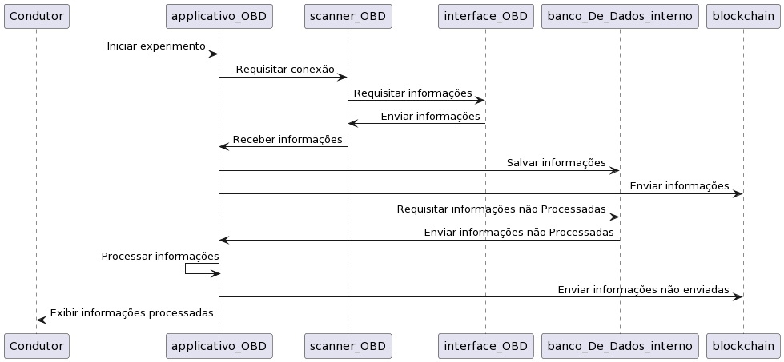
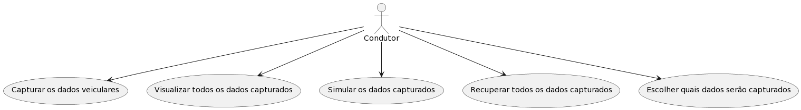

# 📱 Aplicativo de Monitoramento Veicular (obdapp)

Este repositório contém o `obdapp`, um aplicativo desenvolvido em Flutter como parte de um projeto de mestrado. O objetivo principal do aplicativo é coletar dados veiculares em tempo real através da interface OBD-II, processá-los e enviá-los para uma plataforma em nuvem (AWS) para análise e rastreamento do comportamento veicular.

## 📑 Índice

- [Visão Geral](#-visão-geral)
- [✨ Funcionalidades Principais](#-funcionalidades-principais)
- [🛠️ Tecnologias Utilizadas](#️-tecnologias-utilizadas)
- [⚙️ Arquitetura do Sistema](#️-arquitetura-do-sistema)
- [🔧 Pré-requisitos](#-pré-requisitos)
- [🚀 Configuração e Instalação](#-configuração-e-instalação)
  - [1. Clonar o Repositório](#1-clonar-o-repositório)
  - [2. Configurar o Flutter](#2-configurar-o-flutter)
  - [3. Configurar a AWS](#3-configurar-a-aws)
  - [4. Permissões](#4-permissões)
- [ሩ Como Executar](#-como-executar)
- [📂 Estrutura do Projeto](#-estrutura-do-projeto)
- [🧩 Dependências Chave](#-dependências-chave)
- [🖼️ Telas e Fluxo](#️-telas-e-fluxo)
- [🤝 Contribuindo](#-contribuindo)
- [📄 Licença](#-licença)
- [📧 Contato](#-contato)

## 🔭 Visão Geral

O `obdapp` permite a conexão com adaptadores OBD-II via Bluetooth para ler diversos parâmetros do veículo. Os dados coletados são armazenados localmente utilizando Hive e, quando disponível, sincronizados com a plataforma de nuvem AWS. O aplicativo também captura dados de sensores do dispositivo móvel e informações de GPS, enriquecendo a análise do comportamento de condução. Uma funcionalidade adicional permite o registro fotográfico de bombas de combustível, potencialmente para controle de abastecimento e armazenamento em AWS S3.

## ✨ Funcionalidades Principais

-   **📡 Conexão OBD-II:**
    -   Conecta-se a dispositivos OBD-II via Bluetooth (`flutter_bluetooth_serial`).
    -   Descoberta e seleção de PIDs (Parameter IDs) suportados pelo veículo.
-   **🚗 Coleta de Dados Veiculares em Tempo Real:**
    -   Leitura de dados como velocidade, RPM, temperatura do motor, carga do motor, etc.
    -   Coleta de dados brutos e processados do OBD.
-   **📱 Coleta de Dados de Sensores do Dispositivo:**
    -   Utilização de `sensors_plus` para coletar dados de acelerômetro, giroscópio, etc.
-   **🗺️ Rastreamento por GPS:**
    -   Coleta de dados de localização (`geolocator`).
    -   Exibição de mapas na interface (`flutter_map`).
-   **📸 Captura de Fotos:**
    -   Funcionalidade para tirar fotos (ex: bomba de combustível) usando `image_picker`, com armazenamento em AWS S3.
-   **🧠 Processamento de Dados:**
    -   Cálculos e transformações sobre os dados coletados (ex: `math_expressions`).
    -   Lógica para detecção de falhas na comunicação com o veículo.
    -   Processamento de dados via AWS Lambda.
-   **🗂️ Armazenamento de Dados:**
    -   **Local:** Utiliza Hive (`hive`, `hive_flutter`) para armazenamento persistente no dispositivo, permitindo funcionamento offline.
    -   **Nuvem:** Envio dos dados para AWS via API Gateway e Lambda, com persistência em AWS DynamoDB (dados OBD) e AWS S3 (fotos).
-   **👤 Interface do Usuário:**
    -   Interface para condutores com visualização simplificada dos dados.
    -   Gráficos para visualização de dados históricos e em tempo real (`syncfusion_flutter_charts`).
    -   Navegação intuitiva com `auto_route` e `salomon_bottom_bar`.
-   **⚙️ Tarefas em Background:**
    -   Utilização de `workmanager` para executar tarefas em segundo plano (ex: upload de dados).
-   **🔐 Segurança (Potencial):**
    -   Dependências como `elliptic`, `ecdsa`, `crypto` sugerem funcionalidades de segurança ou assinatura de dados. As interações com AWS podem ser protegidas usando AWS IAM e Signature V4 (`aws_signature_v4`).

## 🛠️ Tecnologias Utilizadas

-   **Flutter:** Framework UI para desenvolvimento de aplicações nativas multiplataforma.
-   **Dart:** Linguagem de programação utilizada pelo Flutter.
-   **AWS (Amazon Web Services):**
    -   **AWS Lambda:** Para execução de lógica de backend sem servidor (processamento de dados).
    -   **AWS API Gateway:** Para criar e gerenciar APIs que expõem as funções Lambda.
    -   **AWS S3 (Simple Storage Service):** Para armazenamento de objetos (como fotos de bombas de combustível).
    -   **AWS DynamoDB:** Banco de dados NoSQL para persistência dos dados OBD coletados.
    -   **AWS IAM (Identity and Access Management):** Para gerenciar permissões de acesso aos serviços AWS.
-   **Hive:** Banco de dados NoSQL leve e rápido para armazenamento local no dispositivo.
-   **flutter_bluetooth_serial:** Para comunicação Bluetooth com adaptadores OBD-II.
-   **geolocator:** Para obter coordenadas GPS.
-   **sensors_plus:** Para acesso a sensores do dispositivo.
-   **auto_route:** Para gerenciamento de rotas e navegação.
-   **Outras dependências importantes:** `http` (para chamadas HTTP à API Gateway), `aws_signature_v4`, `aws_common` (para interagir com serviços AWS).

## ⚙️ Arquitetura do Sistema

O fluxo de dados geral do aplicativo é:

1.  **Coleta de Dados:**
    *   O aplicativo se conecta a um adaptador OBD-II via Bluetooth.
    *   Dados do veículo (PIDs), GPS e sensores do celular são coletados.
    *   O usuário pode capturar fotos (ex: bomba de combustível).
2.  **Armazenamento Local:**
    *   Os dados coletados são primeiramente armazenados em um banco de dados local Hive.
3.  **Sincronização com a Nuvem (AWS):**
    *   Quando há conexão, os dados são enviados para a AWS:
        *   Requisições HTTP (contendo dados OBD, de sensores, etc.) são feitas para um endpoint do AWS API Gateway.
        *   O API Gateway aciona uma função AWS Lambda.
        *   A função Lambda processa os dados e os armazena em uma tabela AWS DynamoDB.
        *   Fotos são enviadas para um bucket AWS S3, possivelmente com a Lambda tratando metadados ou links em DynamoDB.
4.  **Visualização e Interação:**
    *   O usuário interage com a interface do aplicativo para visualizar dados.

*Imagem representando o fluxo de interação (fluxodeinteração.png):*


## 🔧 Pré-requisitos

-   Flutter SDK (versão especificada em `pubspec.yaml` no `environment: sdk:`)
-   Dart SDK (compatível com a versão do Flutter)
-   Conta AWS configurada.
-   AWS CLI (Command Line Interface) instalado e configurado localmente.
-   Um editor de código como Android Studio ou VS Code com os plugins Flutter e Dart.
-   Um dispositivo Android/iOS ou emulador/simulador.
-   Um adaptador OBD-II Bluetooth.

## 🚀 Configuração e Instalação

### 1. Clonar o Repositório
```bash
git clone https://github.com/gabestk/app_mestrado.git # Substitua se necessário
cd app_mestrado
```

### 2. Configurar o Flutter
```bash
flutter pub get
```

### 3. Configurar a AWS
Este projeto utiliza serviços AWS para o backend.

1.  **Configurar AWS CLI:**
    *   Instale o AWS CLI em sua máquina.
    *   Configure suas credenciais executando `aws configure`. Você precisará de um Access Key ID, Secret Access Key, região padrão e formato de saída. Essas credenciais devem ter permissões para interagir com API Gateway, Lambda, S3 e DynamoDB.
2.  **Deployment dos Serviços AWS:**
    *   **AWS Lambda:** Você precisará criar e fazer o deploy das funções Lambda que irão receber os dados do app, processá-los e armazená-los. O código da função Lambda não está neste repositório e deve ser gerenciado separadamente.
    *   **AWS API Gateway:** Configure um API Gateway com os endpoints necessários para acionar suas funções Lambda. Anote a URL base da API.
    *   **AWS DynamoDB:** Crie uma tabela no DynamoDB para armazenar os dados OBD. Defina a chave primária e outros índices conforme necessário.
    *   **AWS S3:** Crie um bucket no S3 para armazenar as fotos. Configure as permissões do bucket adequadamente (por exemplo, para permitir que a função Lambda coloque objetos ou que o app faça upload direto, se for o caso).
3.  **Configuração no Aplicativo:**
    *   Você precisará configurar no código do aplicativo (provavelmente em variáveis de ambiente ou um arquivo de configuração não versionado) a URL do seu API Gateway e quaisquer outros parâmetros específicos da AWS (como nomes de bucket S3, se o upload for direto).

Consulte a [documentação oficial da AWS](https://aws.amazon.com/documentation/) para detalhes sobre como configurar cada um desses serviços.

### 4. Permissões
O aplicativo requer permissões de Localização, Bluetooth, Armazenamento (Android antigo) e Câmera/Galeria. Estas devem estar declaradas no `AndroidManifest.xml` e `Info.plist`, e são solicitadas em tempo de execução.

## ሩ Como Executar
```bash
flutter run
```

## 📂 Estrutura do Projeto
-   `lib/`
    -   `dataBaseClass/`: Contém as classes de modelo de dados (ex: `obdRawData.dart`, `vehiclesUser.dart`) e seus adaptadores Hive gerados (`*.g.dart`).
    -   `functions/`: Módulos com lógica central do aplicativo:
        -   `InternalDatabase.dart`: Gerenciamento do banco de dados local Hive.
        -   `firebaseOptions.dart`: (Nota: Este arquivo é específico do Firebase. Se o Firebase foi completamente removido, este arquivo pode não ser mais necessário ou relevante. Se mantido, pode ser um resquício de configuração anterior).
        -   `math.dart`: Funções matemáticas auxiliares.
        -   `obdPlugin.dart`: Lógica para interação com o plugin OBD.
        -   `repository.dart`: (Nota: Este arquivo anteriormente interagia com o Firestore. Precisará ser adaptado ou sua função reavaliada para uma arquitetura AWS. Pode conter lógica para chamadas HTTP para o API Gateway).
        -   `security.dart`: (Potencialmente) Funções relacionadas à segurança.
    -   `route/`: Configuração de navegação utilizando `auto_route`.
    -   `screens/`: Widgets que representam as diferentes telas do aplicativo.
    -   `widgets/`: Widgets reutilizáveis.
    -   `main.dart`: Ponto de entrada principal do aplicativo.
-   `android/` & `ios/`: Configurações específicas da plataforma.
-   `pubspec.yaml`: Dependências do projeto.
-   `condutor.png` & `fluxodeinteração.png`: Imagens.

## 🧩 Dependências Chave

-   **`http`:** Para fazer chamadas HTTP para o AWS API Gateway.
-   **`aws_signature_v4` & `aws_common`:** Para assinar e autenticar requisições para serviços AWS, se necessário.
-   **`hive` & `hive_flutter`:** Para armazenamento local.
-   **`flutter_bluetooth_serial`:** Para comunicação Bluetooth.
-   **`geolocator`:** Para GPS.
-   **`sensors_plus`:** Para sensores do dispositivo.
-   **`auto_route` & `auto_route_generator`:** Para navegação.
-   **`image_picker`:** Para câmera e galeria.
-   **`cloud_firestore`, `firebase_core`:** (Nota: Estas são dependências do Firebase. Se o projeto foi migrado completamente para AWS, elas podem ser candidatas à remoção do `pubspec.yaml` para evitar confusão e tamanho desnecessário do app, a menos que alguma funcionalidade Firebase residual ainda seja intencionalmente usada).

## 🖼️ Telas e Fluxo

*Interface principal do condutor (condutor.png):*


O fluxo de interação do usuário geralmente envolve:
1.  Abrir o aplicativo.
2.  Conectar-se a um adaptador OBD-II.
3.  Iniciar uma sessão de monitoramento/viagem.
4.  Visualizar dados em tempo real (velocidade, RPM, mapa, etc.).
5.  Acessar o histórico de viagens/dados.
6.  Configurar preferências (se aplicável).

## 🤝 Contribuindo

Contribuições são bem-vindas! Se você deseja contribuir para este projeto, por favor, siga estas etapas:

1.  Faça um Fork do repositório.
2.  Crie uma nova Branch (`git checkout -b feature/sua-feature`).
3.  Faça suas alterações e commit (`git commit -m 'Adiciona sua-feature'`).
4.  Faça um Push para a Branch (`git push origin feature/sua-feature`).
5.  Abra um Pull Request.

Por favor, tente manter a consistência do código e adicione comentários onde necessário.

## 📄 Licença

Este projeto não possui um arquivo de licença definido. Recomenda-se adicionar um, como MIT, Apache 2.0, ou GPL, dependendo dos requisitos do projeto de mestrado e das dependências utilizadas. Para adicionar uma licença MIT, por exemplo, crie um arquivo `LICENSE` na raiz do projeto com o seguinte conteúdo:

```
MIT License

Copyright (c) [Ano] [Nome Completo do Proprietário do Repositório]

Permission is hereby granted, free of charge, to any person obtaining a copy
of this software and associated documentation files (the "Software"), to deal
in the Software without restriction, including without limitation the rights
to use, copy, modify, merge, publish, distribute, sublicense, and/or sell
copies of the Software, and to permit persons to whom the Software is
furnished to do so, subject to the following conditions:

The above copyright notice and this permission notice shall be included in all
copies or substantial portions of the Software.

THE SOFTWARE IS PROVIDED "AS IS", WITHOUT WARRANTY OF ANY KIND, EXPRESS OR
IMPLIED, INCLUDING BUT NOT LIMITED TO THE WARRANTIES OF MERCHANTABILITY,
FITNESS FOR A PARTICULAR PURPOSE AND NONINFRINGEMENT. IN NO EVENT SHALL THE
AUTHORS OR COPYRIGHT HOLDERS BE LIABLE FOR ANY CLAIM, DAMAGES OR OTHER
LIABILITY, WHETHER IN AN ACTION OF CONTRACT, TORT OR OTHERWISE, ARISING FROM,
OUT OF OR IN CONNECTION WITH THE SOFTWARE OR THE USE OR OTHER DEALINGS IN THE
SOFTWARE.
```
Substitua `[Ano]` e `[Nome Completo do Proprietário do Repositório]` pelas informações corretas.

## 📧 Contato

Para dúvidas ou informações sobre o projeto, entre em contato com o desenvolvedor principal:
-   Nome: (Nome do Desenvolvedor Principal - verificar `pubspec.yaml` ou commits)
-   Email: (Email do Desenvolvedor - verificar `pubspec.yaml` ou commits)
-   GitHub: [gabestk](https://github.com/gabestk) (Baseado na URL do clone no README original)

```
